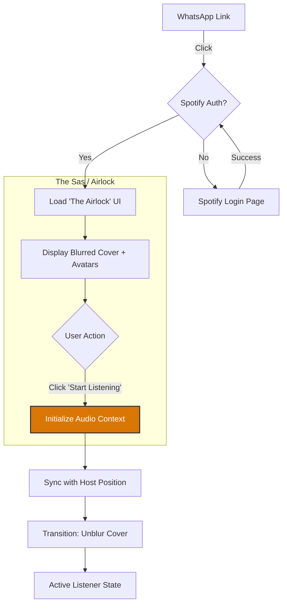
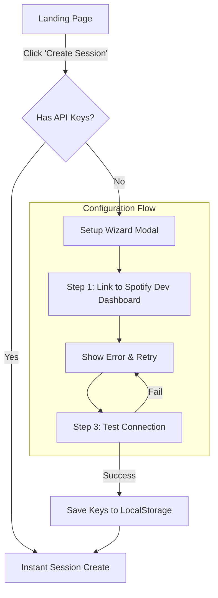
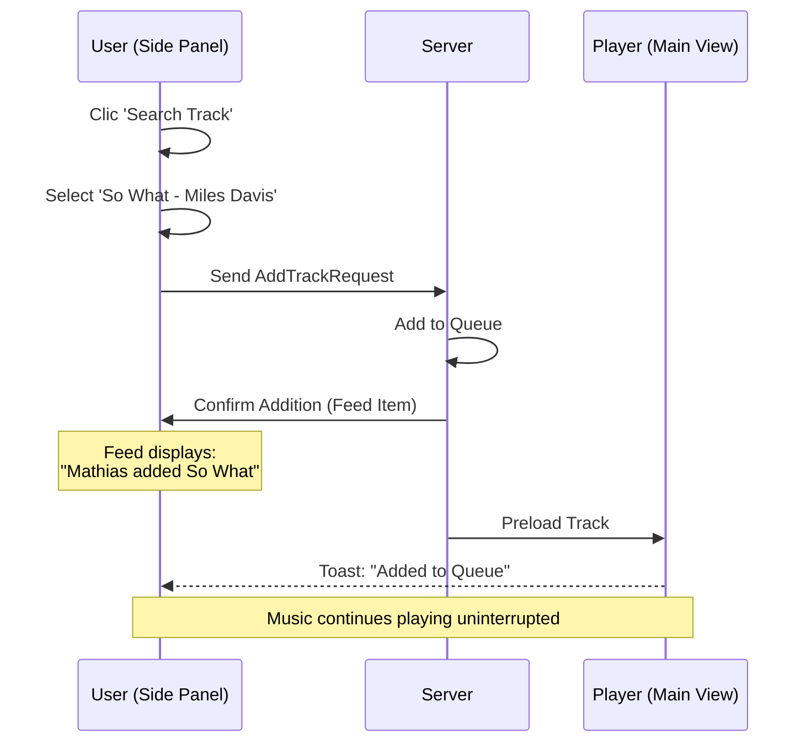

# UX Design Specification boeuf

**Author:** Mathias
**Date:** 2026-01-22

---

## Executive Summary

### Project Vision

boeuf est un service d'orchestration musicale "semi-transparent" qui relie les comptes Spotify des utilisateurs. **Philosophie "Trust but Verify"** : l'interaction principale se fait naturellement via l'application Spotify native (choix musique, play/pause), permettant à boeuf d'agir comme un chef d'orchestre fiable en arrière-plan. L'interface web de boeuf sert de "tableau de bord de confiance" : elle confirme que la synchronisation est active, gère les exceptions (déconnexions), et fournit des contrôles de secours (backup controls) si nécessaire. Elle ne cherche pas à remplacer l'UI de Spotify mais à la compléter pour la dimension sociale.

### Target Users

* **Utilisateurs Spotify** (Host et Invités) qui veulent partager la musique sans friction.
* Ils privilégient leur confort d'usage (app native) mais ont besoin d'être rassurés sur le fait qu'ils sont bien "ensembles".
* Ils n'ouvriront l'interface de boeuf que pour trois raisons : l'initialisation (onboarding), la vérification (en cas de doute sur la synchro), ou la curiosité (historique/qui est là).

### Key Design Challenges

1. **Équilibre Visibilité/Invisibilité** : L'interface doit être assez légère pour ne pas être envahissante, mais assez informative pour rassurer d'un coup d'œil ("Lumière verte = tout va bien").
2. **Gestion des interruptions (Failover)** : Si la synchro casse, l'alerte doit être efficace (Notifications navigateur, changement d'état visuel clair) pour inviter l'utilisateur à réagir, sans créer de panique.
3. **Onboarding Pédagogique** : Expliquer clairement le modèle mental "Utilisez Spotify normalement, on s'occupe du reste" dès les premières secondes pour éviter la confusion sur "où dois-je cliquer pour jouer ?".
4. **Contrôles Secondaires** : Intégrer des boutons de contrôle (Play/Pause/Skip) dans l'interface boeuf sans qu'ils ne prennent le pas sur l'information d'état. Ils sont là "au cas où".

### Design Opportunities

1. **Dashboard "Zen"** : Une interface épurée qui affiche l'état de santé de la session (Ping/Sync status) et le morceau en cours. C'est le "moniteur de contrôle" de la fête.
2. **Notifications Intelligentes** : Utiliser les notifications du navigateur pour alerter de problèmes critiques (déconnexion) sans obliger l'utilisateur à garder l'onglet au premier plan.
3. **Visualisation de l'Invisible** : Montrer les "rouages" de manière rassurante : "X est Host", "Y a ajouté un titre", "Resynchronisation en cours...".

**Resynchronisation en cours...".

## Core User Experience

### Defining Experience

L'expérience centrale est celle d'une **extension invisible de la réalité musicale**.

* **Action Clé (Invité)** : Rejoindre une session via un lien universel. L'utilisateur ne "navigue" pas dans boeuf, il entre dans une "pièce virtuelle" et en ressort.
* **Action Clé (Admin)** : Configurer l'instance (création App Spotify unique) pour permettre cette magie.

### Platform Strategy

* **Web-based unifié** : Pas d'installation native pour le MVP.
* **Desktop First** : Conçu prioritairement pour l'usage "Station de travail" (dev/bureau) où l'utilisateur a ses onglets ouverts.
* **Mobile Functional** : Le site doit être utilisable sur mobile (responsive) pour permettre de rejoindre/vérifier, mais sans être une PWA optimisée dès le départ.

### Effortless Interactions

* **Magic Link** : L'URL de session contient tout le nécessaire. Un clic suffit pour arriver au bon endroit.
* **Playlist-as-Controller** : L'utilisateur ajoute un titre dans Spotify -> Il apparaît chez les autres. Zéro interaction avec boeuf.
* **Strict Sync** : Pas de question posée. Quelqu'un met pause ? La musique s'arrête. C'est brut, immédiat, et prévisible.

### Critical Success Moments

1. **Le "Link-to-Music" (Time to Music)** : Le temps entre le clic sur le lien WhatsApp et la première note de musique entendue. Doit être minimal.
2. **L'Onboarding Admin** : Le moment où l'utilisateur "Technique" doit configurer ses clés API Spotify. S'il échoue ici, personne n'utilise l'app. Ce flux doit être documenté avec une précision chirurgicale (screenshots, guide pas-à-pas).

### Experience Principles

1. **Host Burden, Guest Flow** : La complexité technique (création app Spotify, whitelist emails) est portée par l'Host (Admin). L'Invité doit avoir une expérience zéro friction.
2. **Visible Backup Controls** : L'interface offre des boutons de contrôle (Play/Pause/Skip) visibles mais secondaires, servant de "télécommande de secours" ou de preuve de bon fonctionnement.
3. **Synchronisation Stricte** : Nous privilégions une synchro "dure" (Pause = Pause Groupe) pour le MVP. Les mécanismes de rattrapage (Catch-up doux) sont pour plus tard.

## Desired Emotional Response

### Primary Emotional Goals

1. **Connexion (Togetherness)** : Le but ultime. Faire oublier la distance physique (500km) pour ne laisser que la proximité musicale.
2. **Satisfaction Simple (It Just Works)** : Un sentiment de soulagement et de plaisir immédiat quand la musique démarre synchronisée. "C'est aussi simple que ça."
3. **Sérénité (Trust)** : L'absence de vigilance technique. L'utilisateur ne doit pas se demander "Est-ce que ça marche encore ?", il doit juste profiter.

### Emotional Journey Mapping

1. **Rejoindre (Guest)** : *Curiosité* -> *Satisfaction immédiate* (dès que le son sort).
2. **Écoute (Flux)** : *Complicité*. Sentir la présence de l'autre à travers ses choix musicaux.
3. **Interruption (Pause)** : *Attention sociale*. Non pas "Ça a coupé !", mais "Tiens, Marc a mis pause, il se passe quelque chose".
4. **Fin de session** : *Accomplissement*. "C'était une bonne session de travail/soirée", sans fatigue technique.

### Micro-Emotions

* **Confidence** : Renforcée par des feedbacks discrets mais affirmatifs (ex: Notification "Sync OK").
* **Presence** : Sentir que l'autre est là, même sans chat vidéo. La musique est le vecteur de présence.
* **Relief** : Pour l'Host, passer de la complexité du setup à la fluidité de l'usage.

### Design Implications

* **Pause = Communication** : L'interface ne doit pas juste arrêter le son. Elle doit notifier : "Marc a mis en pause". Cela humanise l'arrêt technique.
* **Feedback de Succès** : Lors de la première synchronisation, un petit indicateur visuel (ex: "Connecté avec Jules") doit valider le succès immédiat.
* **Silence Technique** : Masquer les micro-ajustements techniques (buffering, resync légère) pour ne montrer que la stabilité.

### Emotional Design Principles

1. **Humaniser la Technique** : Chaque action technique (pause, skip, add) est présentée comme une action humaine ("Marc a ajouté...", "Jules a passé...").
2. **Sérénité par le Minimalisme** : Moins il y a de boutons et d'informations, plus l'utilisateur se sent en confiance (surcharge = anxiété).
3. **La Musique d'abord** : L'émotion vient du son, pas de l'interface. L'UI doit s'effacer pour laisser place à l'écoute.

## UX Pattern Analysis & Inspiration

### Inspiring Products Analysis

* **Discord (Salons Vocaux)** : L'inspiration majeure. Une "Room" persistante où l'on entre et sort librement sans sonnerie ni formalité. La présence est indiquée passivement (on voit qui est là). Si je suis seul dans le salon, ça marche quand même. Si quelqu'un arrive, il s'intègre au flux.
* **Minecraft (Serveurs)** : Le concept de monde persistant. Je me connecte au serveur : s'il y a des amis, on joue ensemble ; sinon, je joue seul. La connexion d'un ami est un événement positif ("X joined the game") mais non bloquant.
* **Google Docs (Presence)** : La visualisation subtile de l'activité. Les avatars en haut à droite montrent *qui* est là, et les curseurs montrent *ce qu'ils font*, sans bloquer mon propre travail. C'est l'essence du "Host Tournant" visuel.

### Transferable UX Patterns

* **The "Lobby" Paradigm** : Au lieu d'un "Appel", on crée un "Lobby" ou une "Session". L'URL est la clé de la porte.
* **Passive Presence Indicators** : Afficher la liste des participants présents comme une simple liste d'avatars (comme Discord), plutôt que comme une grille de visages (comme Zoom).
* **Non-Blocking Join/Leave** : L'arrivée ou le départ d'un participant notifie discrètement (toast notification ou log dans le chat) mais n'interrompt JAMAIS la musique.
* **State Persistence** : Si je quitte et reviens, la session existe toujours, la musique a continué (ou s'est arrêtée si tout le monde est parti).

### Anti-Patterns to Avoid

* **The "Ring" (Sonnerie)** : Ne jamais obliger quelqu'un à "récrocher". L'invitation est asynchrone (lien), la jonction est volontaire.
* **The "Call Dropped" Anxiety** : Contrairement à un appel où la coupure est fatale, ici une déconnexion doit être traitée comme un "départ temporaire". La musique continue pour les autres.
* **Exclusive Focus** : Éviter les interfaces plein écran qui monopolisent l'attention. L'utilisateur doit pouvoir réduire la fenêtre et oublier.

### Design Inspiration Strategy

* **Adopter** : La sémantique visuelle de Discord pour la liste des utilisateurs (colonne latérale ou avatars ronds discrets).
* **Adapter** : Le concept de "Serveur" simplifié en "Session éphémère" (qui dure le temps de l'écoute, ~24h).
* **Éviter** : Tout ce qui ressemble à une interface de visioconférence (boutons Raccrocher rouges, vue grille, demande d'accès intrusive).

## Design System Foundation

### 1.1 Design System Choice

* **Foundation** : **Shadcn/ui (Vue port)** + **Tailwind CSS**.
* **Vibe** : "Musician's Studio" / "Jazz Club" (Chaleureux, Organique, Artistique). Pas de "Gamer Aesthetic".

### Rationale for Selection

* **Neutralité Structurelle** : Shadcn fournit des composants (boutons, inputs, dialogs) d'une grande pureté, servant de toile blanche pour notre identité artistique.
* **Flexibilité** : Contrairement à Material UI qui impose une structure stricte, Shadcn permet de modifier l'âme du composant (bordures, fonts, ombres) pour coller à l'esthétique "Jazzy" (ex: bordures plus douces, polices Serif).
* **Vitesse MVP** : Permet d'assembler l'expérience "Invisible" rapidement avec des composants accessibles et solides, sans passer des semaines sur le CSS.

### Implementation Approach

1. **Phase 1 (MVP)** : Utilisation des composants Shadcn "Out of the box" en mode Dark (pour l'ambiance soirée/écoute), avec une palette neutre (Grayscale).
2. **Phase 2 (Identity)** : Injection de la "Soul" : choix d'une typographie de caractère (ex: une Serif élégante pour les titres) et d'une couleur d'accent chaude (Ocre/Gold/Deep Red) pour s'éloigner de l'aspect "SaaS générique".

### Customization Strategy

* **Typography** : Sera le vecteur principal de l'émotion artistique.
* **Radius & Spacing** : Espaces généreux pour laisser "respirer" la musique.
* **Iconography** : Icônes fines et élégantes (Lucide Icons, par défaut dans Shadcn, conviennent très bien).

## 2. Core User Experience

### 2.1 Defining Experience

Le **"Musical Handshake"** (Poignée de main musicale).
C'est le moment de transition où l'utilisateur passe de "Spectateur" (il voit la session) à "Auditeur" (son Spotify se synchronise).
Ce n'est pas automatique, c'est un acte volontaire : un bouton explicite **"Start Listening"** ou **"Sync Now"** qui déclenche la télékinésie vers Spotify.

### 2.2 User Mental Model

* **Modèle Mental** : "Je rentre dans une pièce, puis je mets mon casque".
* **Attente** : Je veux voir où je mets les pieds (quel morceau ? qui est là ?) AVANT que le son ne m'explose aux oreilles.
* **Friction** : L'utilisateur sait que contrôler une app (Spotify) depuis une page web (boeuf) est inhabituel. Ce bouton "Start" est le pont cognitif qui valide cette connexion.

### 2.3 Success Criteria

1. **Safety First** : Aucun son ne sort tant que l'utilisateur n'a pas explicitement cliqué sur le bouton d'activation.
2. **Instant Feedback** : Dès le clic, l'UI doit passer de l'état "Ready" à l'état "Synchronized" visuellement (changement de couleur, animation de spectre audio).
3. **One-Click Magic** : Après ce clic unique, plus aucune interaction n'est requise. Le "Handover" est complet.

### 2.4 Novel UX Patterns

* **The "Airlock" Pattern (Sas)** : Un écran intermédiaire après le login mais avant la musique.
  * *Contenu* : Pochette de l'album en cours (floue ou N&B), Avatars des présents.
  * *Action* : Un seul bouton primaire call-to-action au centre.
  * *Métaphore* : Comme rejoindre un appel vocal Discord ("Join Voice"), mais pour de la musique.

### 2.5 Experience Mechanics

1. **Initiation** : Arrivée sur l'URL -> Login Spotify (si nécessaire) -> Arrivée dans le "Sas".
2. **Inspection** : L'utilisateur voit "Marc écoute 'Pink Floyd'". L'état est "Connecté, en attente audio".
3. **Interaction** : Clic sur "Start Listening".
4. **Feedback** : Loader rapide -> Spotify se lance en arrière-plan -> La pochette devient nette/colorée -> La barre de progression se cale sur celle de Marc.
5. **Completion** : L'utilisateur peut réduire la fenêtre ou poser son téléphone. C'est fini.

## Visual Design Foundation

### Color System

* **Atmosphere (Backgrounds)** : **Warm Charcoal** / **Deep Espresso**. Pas de noir pur (#000000), mais des gris très sombres teintés de brun pour une douceur "analogique" (#1A1816, #2D2A26).
* **Accent (Soul)** : **Burnt Orange / Amber**. Une couleur incandescente qui évoque les lampes à filament et les vieux amplis. Utilisée pour les actions principales (Bouton "Start Listening") et les états actifs (Barre de progression).
* **Functional (Tech)** : **Slate Grey** (pour les textes secondaires) et **Green** (discret, uniquement pour le signal "Sync OK").

### Typography System

* **Display / Headings (The Soul)** : **Fraunces**. Une police Serif variable avec beaucoup de personnalité, un peu "soft" et "groovy". Elle sera utilisée pour le nom de l'app, les grands titres de session ("Marc's Session") et les moments d'émotion.
* **Body / UI (The Structure)** : **Inter**. Une Sans-Serif robuste, lisible et neutre. Elle portera toute la charge cognitive (titres de morceaux, liste d'utilisateurs, temps) sans entrer en conflit avec Fraunces.

### Spacing & Layout Foundation

* **Breathable Design** : Espacements généreux (Base 8px, mais utilisation fréquente de 32px/48px/64px). L'interface ne doit pas être dense.
* **Center Stage** : Layout centré. L'élément principal (la pochette, le contrôle) est au centre, comme un artiste sur scène. Les infos secondaires (utilisateurs) sont en périphérie.

### Accessibility Considerations

* **Contrast Check** : L'orange sur fond sombre doit être calibré pour garantir un ratio WCAG AA. On privilégiera un Ambre lumineux sur Charcoal sombre.
* **Focus States** : Les états de focus clavier utiliseront une bague claire (blanc/gris clair) plutôt que l'orange pour garantir la visibilité.

## Design Direction Decision

### Selected Direction: "The Smart Zen" (Hybrid)

Suite à l'exploration des pistes visuelles, nous avons convergé vers une direction hybride qui réconcilie l'exigence d'invisibilité (background app) et le besoin de sociabilité (chat/historique).

* **Core Concept**: Une interface à deux vitesses.
    1. **Mode "Zen" (Défaut)** : Un player minimaliste centré (Pochette + Titre) qui ne distrait pas. C'est le "moniteur de confiance".
    2. **Mode "Social" (À la demande)** : Un panneau latéral redimensionnable (Side Panel) qui s'ouvre pour révéler la vie du groupe.

### Key UX Mechanics

1. **The "Sas" (Airlock)** :
   * L'application ne démarre jamais la musique seule (blocage autoplay navigateur).
   * État initial : Pochette floutée + Gros bouton "Start Listening".
   * Une fois cliqué, l'interface s'anime et le player devient net.

2. **The Unified Feed (Social Panel)** :
   * Plutôt que de séparer "Historique" et "Chat", tout est unifié dans le panneau latéral.
   * **"Tracks are Messages"** : L'ajout d'un morceau par Jules apparaît comme une bulle dans le flux, au même titre qu'un message texte.
   * Cela renforce l'idée que la musique *est* la communication principale.

3. **Resizable Panel** :
   * Le panneau social n'est pas un tiroir (overlay) qui masque le contenu, mais un panneau adjacent qui redimensionne le layout (Split view).
   * L'utilisateur peut l'élargir pour lire le chat confortablement, ou le fermer totalement pour revenir au mode Zen.

### Visual Signature

* **Palette** : Fond Deep Charcoal `#1A1816` + Accents Amber `#D97706`.
* **Typography** : Titres en *Fraunces* (Soul), UI en *Inter* (Tech).
* **Feedback** : Avatars ronds pour la présence, indicateurs d'état subtils.

## User Journey Flows

### Journey 1: The Guest Entry ("Time to Music")

**Goal**: Convert a click on a WhatsApp link into a synchronized listening experience with zero friction.
**Key Design Pattern**: "The Airlock" (Le Sas) - Managing the transition from passive web browsing to active audio context.

### Journey 2: The Host Setup (Technical Onboarding)

**Goal**: Guide a non-technical host through the one-time configuration of Spotify API keys without overwhelming them.
**Key Design Pattern**: "Progressive Disclosure" - Only show complex fields when necessary.

### Journey 3: The Social Loop (Unified Side Panel)

**Goal**: Allow social interaction (chat + music selection) without interrupting the listening flow.
**Key Design Concept**: "Tracks are Messages" - Treating song additions as part of the conversation.

### Flow Error Recovery

* **Autoplay Blocked**: If the browser blocks audio, the "Start Listening" button reappears with a "Click to Resume" pulse animation.
* **Desync**: If the user drifts >3s, a localized "Syncing..." toast appears, audio fades out briefly, seeks, and fades in (no harsh cuts).

## Component Strategy

### 1. Design System Coverage (Shadcn/Vue)

We will leverage the following Shadcn primitives to accelerate development:

* **Structure**: `Card` (Auth forms), `Sheet` (Mobile menu), `Resizable` (Side panel base).
* **Feedback**: `Toast` (Notifications), `Skeleton` (Loading states), `Progress` (Audio playback).
* **Forms**: `Button` (Primary actions), `Input` (Chat), `Avatar` (User presence).

### 2. Custom Component Specifications

These components are unique to the "Smart Zen" experience and must be built custom.

### `MusicPlayerDisplay`

**Purpose**: The hero component. Displays current track info in the center stage.
**Anatomy**:

* Large Album Art (Shadowed)
* Title (Fraunces, animated if too long)
* Artist (Inter, muted)
* Progress Bar (Interactive on hover only for Host)
**States**:
* `Empty`: No music playing (Placeholder icon)
* `Loading`: Skeleton loader for art/text
* `Playing`: Full opacity, shadow active
* `Paused`: Dimmed opacity (0.7), grayscale filter (50%)

### `SasOverlay` (The Airlock)

**Purpose**: The specific screen state for "pre-listening" activation.
**Anatomy**:

* Blurred Background (Current Album Art)
* Central Action Button ("Start Listening")
* Context Info ("Join X, Y and Z")
**Interaction**: Clicking the button emits `start-audio-context` event and performs the transition animation (unblur).

### `SocialPanel`

**Purpose**: The collapsible side container.
**Implementation**: Wraps Shadcn's `ResizablePanel`.
**Behavior**:

* **Desktop**: Resizable, persistent.
* **Mobile**: Transforms into an overlay `Sheet` (Drawer).
* **Layout**: `flex-col`, pinning the "Chat Input" to the bottom and "Feed" taking `flex-1`.

### `FeedBubble`

**Purpose**: A polymorphic list item that can display either text OR a music event.
**Variants**:

* `Type: Chat`: Standard bubble style. Background: `bg-card-lighter`.
* **`Type: Track`**: A mini-card embedded in the flow. Contains thumbnail, title, artist.
  * *Action*: Hovering reveals a "Queue" or "Play" icon depending on context.
  * *Style*: Tinted with Amber (`bg-amber-900/10`) to distinguish from chat.

### `SessionStatusBadge`

**Purpose**: A pill-shaped indicator in the top bar.
**States**:

* `Syncing` (Yellow dot + Pulse)
* `Live` (Green dot + "Synced with [Host]")
* `Offline` (Red dot + "Reconnecting...")

## UX Consistency Patterns

### 1. Feedback Patterns (The "Background" Context)

Since users often have the tab in the background, feedback must be dual-channel.

* **In-App (Foreground)**:
  * **Action Success**: Minimal Toasts (Shadcn `Sonner`). Top-center. 2s duration. E.g., "Added to queue".
  * **State Change**: The Play/Pause button toggles immediately (optimistic UI) before server confirmation.
* **Browser (Background)**:
  * **Tab Title**: Updates dynamically to show status. `▶ Title - Artist` vs `⏸ Paused`.
  * **Favicon**: Adds a tiny badge (Green dot) when active.

### 2. Loading & Buffering

Music buffering is anxiety-inducing. We treat it differently than data loading.

* **Initial Load**: Standard Skeleton loader for text/art.
* **Audio Buffering**: The **Album Art** opacity pulses between 0.5 and 1.0. No spinners overlaying the art (ruins the aesthetic).
* **Queue Transition**: When changing tracks, the Metadata updates *immediately*, the Art cross-fades over 300ms.

### 3. Empty States ("The Void")

When the queue is empty, the player shouldn't look broken.

* **Visual**: A subtle, dark placeholder art (e.g., a faint vinyl groove pattern).
* **Prompt**: A clear call-to-action in the center: "The silence is loud. Add a track."
* **Action**: Clicking the empty art opens the Search/Panel automatically.

### 4. Error Recovery (Non-Blocking)

Errors shouldn't stop the party unless fatal.

* **Transient (Network glitch)**: A small amber pill descends from the top: "Reconnecting...". No modal blocking interactions.
* **Actionable (Spotify Token Expired)**: A persistent banner in the Side Panel: "Spotify disconnected. [Relink]".
* **Fatal (Session Closed)**: The Album Art desaturates completely, overlay text: "Session ended by Host."

## Responsive & Accessibility Strategy

### 1. Responsive Approach: "Adapting Companionship"

We adopt a **Desktop-First** strategy (primary use case: work companion), but ensure full mobile functionality.

* **Desktop (Full Experience)**:
  * **Layout**: Horizon Split (Main Player | Side Panel).
  * **Behavior**: Side panel pushes content (squeeze) or floats depending on width.
  * **States**: Panel can be permanent (`w-96`) or collapsed (`w-0`).

* **Mobile (Focused Experience)**:
  * **Layout**: Stacked. The "Main Player" takes 100vh.
  * **Behavior**: The `SocialPanel` transforms into a **Sheet / Drawer** overlay.
  * **Interaction**: Toggled via the Top Bar button. It covers the player (focus mode: Chat OR Listen).

### 2. Accessibility Compliance (WCAG AA)

* **Color Contrast**:
  * *Critical*: Ensure `Amber-500` text on `Charcoal-900` background meets 4.5:1 ratio. If not, use `Amber-400` for text and `Amber-600` for graphics.
* **Screen Readers**:
  * The "Sas" button must be explicitly labeled: `aria-label="Start Listening and synchronize with session"`.
  * Status updates (Play/Pause) must use `aria-live="polite"` region to announce state changes.
* **Reduced Motion**:
  * The "Buffering Pulse" animation must respect `prefers-reduced-motion: reduce`. In that case, use a static "Buffering..." text indicator instead.
<!-- UX design content will be appended sequentially through collaborative workflow steps -->
